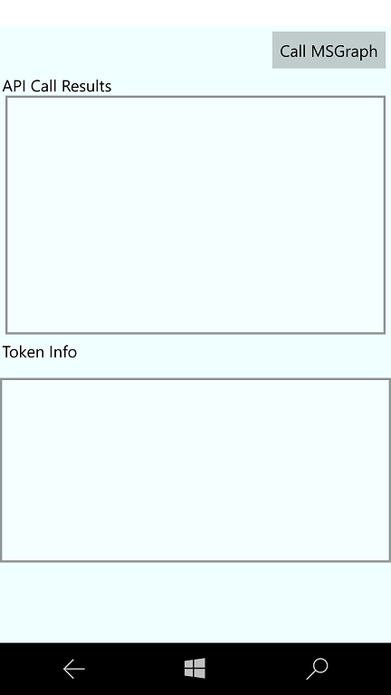

# MSGraph V2

## My Goals

1. Main Goal. An attempt to adapt MS Graph UWP Sample via "UWP down-shifting", for all my devices (PC / XBox , and... MS Lumua 950)
2. Super goal: reconstruct Microsoft TODO API logics... as part of Microsoft Graph .

## Screenshots

## Architecture

## Prerequisites

To run the completed project in this folder, you need the following:

- [Visual Studio](https://visualstudio.microsoft.com/vs/) installed on your development machine. If you do not have Visual Studio, visit the previous link for download options. (**Note:** This tutorial was written with Visual Studio 2019 version 16.5.0. The steps in this guide may work with other versions, but that has not been tested.)
- Either a personal Microsoft account with a mailbox on Outlook.com, or a Microsoft work or school account.

If you don't have a Microsoft account, there are a couple of options to get a free account:

- You can [sign up for a new personal Microsoft account](https://signup.live.com/signup?wa=wsignin1.0&rpsnv=12&ct=1454618383&rver=6.4.6456.0&wp=MBI_SSL_SHARED&wreply=https://mail.live.com/default.aspx&id=64855&cbcxt=mai&bk=1454618383&uiflavor=web&uaid=b213a65b4fdc484382b6622b3ecaa547&mkt=E-US&lc=1033&lic=1).
- You can [sign up for the Office 365 Developer Program](https://developer.microsoft.com/office/dev-program) to get a free Office 365 subscription.

## Register a native application with the Azure Active Directory admin center

1. Open a browser and navigate to the [Azure Active Directory admin center](https://aad.portal.azure.com) and login using a **personal account** (aka: Microsoft Account) or **Work or School Account**.

1. Select **Azure Active Directory** in the left-hand navigation, then select **App registrations** under **Manage**.

1. Select **New registration**. On the **Register an application** page, set the values as follows.

    - Set **Name** to `UWP Graph Tutorial`.
    - Set **Supported account types** to **Accounts in any organizational directory and personal Microsoft accounts**.
    - Under **Redirect URI**, change the dropdown to **Public client (mobile & desktop)**, and set the value to `https://login.microsoftonline.com/common/oauth2/nativeclient`.

1. Choose **Register**. On the **UWP Graph Tutorial** page, copy the value of the **Application (client) ID** and save it, you will need it in the next step.

## Status

Proof-of-concept

## References

https://docs.microsoft.com/en-us/graph/use-the-api

https://docs.microsoft.com/en-us/graph/api/resources/todo-overview?view=graph-rest-1.0

-- [m][e] 2022
